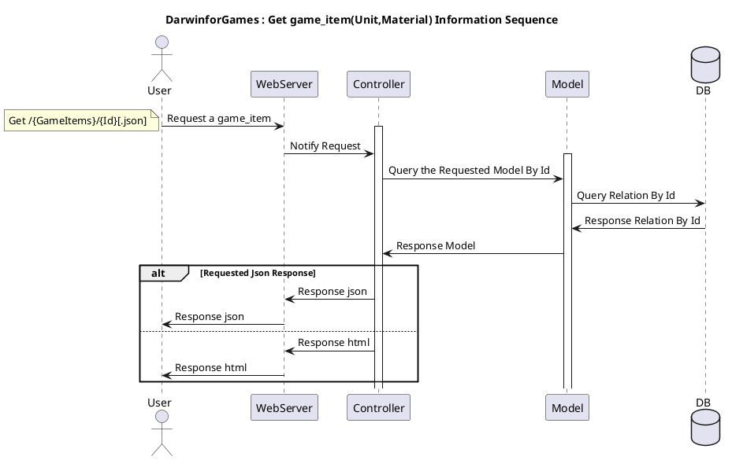
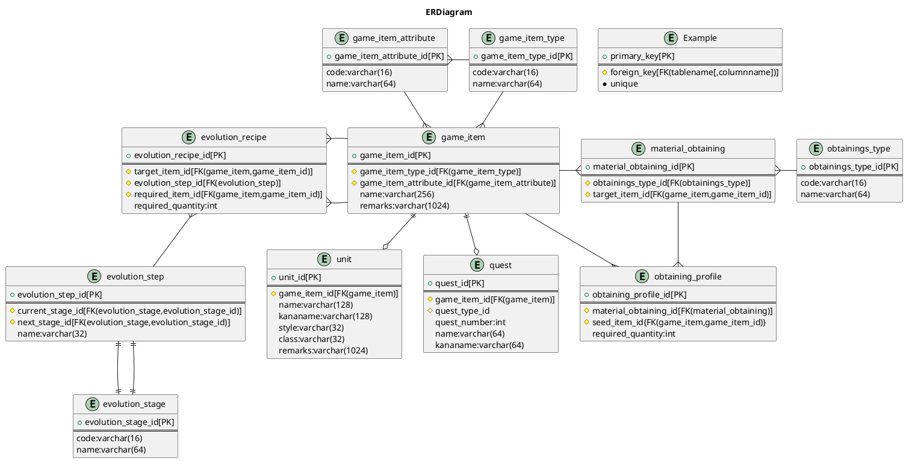

# DarwinforGames UMLDiagrams

[chrome拡張のPegmatite](https://chrome.google.com/webstore/search/Pegmatite)のインストールでgithub上でダイアグラムを確認可能

##

```puml
@startuml {GetGameItemInformationSequence.png}
title DarwinforGames : Get game_item(Unit,Material) Information Sequence

actor User

User -> WebServer : Request a game_item

note left:Get /{GameItems}/{Id}[.json]

activate Controller

WebServer -> Controller : Notify Request

activate Model
database DB

Controller -> Model : Query the Requested Model By Id

Model -> DB : Query Relation By Id

DB -> Model : Response Relation By Id

Model -> Controller : Response Model

alt Requested Json Response
    Controller -> WebServer : Response json
    WebServer -> User : Response json
else
    Controller -> WebServer : Response html
    WebServer -> User : Response html
end
@enduml
```

##

```puml
@startuml
title ERDiagram

entity Example {
    + primary_key[PK]
    ==
    # foreign_key[FK(tablename[,columnname])]
    * unique
}


entity "game_item" {
    + game_item_id[PK]
    ==
    # game_item_type_id[FK(game_item_type)]
    # game_item_attribute_id[FK(game_item_attribute)]
    name:varchar(256)
    remarks:varchar(1024)
}

entity "unit" {
    + unit_id[PK]
    ==
    # game_item_id[FK(game_item)]
    name:varchar(128)
    kananame:varchar(128)
    style:varchar(32)
    class:varchar(32)
    remarks:varchar(1024)
}

entity "quest" {
    + quest_id[PK]
    ==
    # game_item_id[FK(game_item)]
    # quest_type_id
    quest_number:int
    name:varchar(64)
    kananame:varchar(64)
}

entity "evolution_stage" {
    + evolution_stage_id[PK]
    ==
    code:varchar(16)
    name:varchar(64)
}

entity "evolution_step" {
    + evolution_step_id[PK]
    ==
    # current_stage_id[FK(evolution_stage,evolution_stage_id)]
    # next_stage_id[FK(evolution_stage,evolution_stage_id)]
    name:varchar(32)
}

entity "evolution_recipe"{
    + evolution_recipe_id[PK]
    ==
    # target_item_id[FK(game_item,game_item_id)]
    # evolution_step_id[FK(evolution_step)]
    # required_item_id[FK(game_item,game_item_id)]
    required_quantity:int
}

entity "obtaining_profile" {
    + obtaining_profile_id[PK]
    ==
    # material_obtaining_id[FK(material_obtaining)]
    # seed_item_id{FK(game_item,game_item_id)}
    required_quantity:int
}

entity "material_obtaining" {
    + material_obtaining_id[PK]
    ==
    # obtainings_type_id[FK(obtainings_type)]
    # target_item_id[FK(game_item,game_item_id)]
}

entity "obtainings_type" {
    + obtainings_type_id[PK]
    ==
    code:varchar(16)
    name:varchar(64)
}

entity "game_item_type" {
    + game_item_type_id[PK]
    ==
    code:varchar(16)
    name:varchar(64)
}

entity "game_item_attribute" {
    + game_item_attribute_id[PK]
    ==
    code:varchar(16)
    name:varchar(64)    
}


game_item_attribute }- game_item_type
game_item }-up- game_item_type 
game_item }-up- game_item_attribute
game_item ||--o unit 
game_item ||--o quest

evolution_recipe }--ri-- game_item
evolution_recipe }--ri-- game_item
evolution_recipe }-down- evolution_step
evolution_step ||-down-|| evolution_stage
evolution_step ||-down-|| evolution_stage
material_obtaining -down-{ obtaining_profile
game_item -ri-{ material_obtaining
game_item --{ obtaining_profile

material_obtaining }- obtainings_type

@enduml

```

